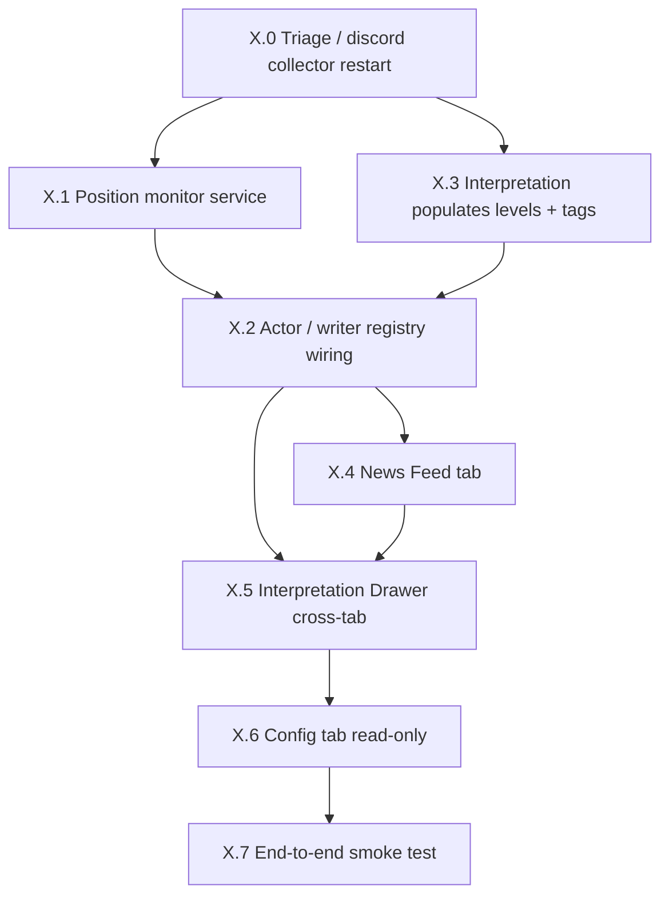

# Phase X — Dashboard & Pipeline Restoration Plan

**Author:** Architect mode
**Date:** 2026-05-02
**Status:** Draft — awaiting user approval before delegation to Code mode
**Predecessors:** Phase L (dashboard foundation), Phase M (drift gates), [`shared/docs/INTELLIGENCE_UNIFIED_PLAN.md`](shared/docs/INTELLIGENCE_UNIFIED_PLAN.md)
**Revision history:**
- v1 (2026-05-02 ~12:00 UTC) — initial 8-phase plan focused on dashboard restoration
- v2 (2026-05-02 ~12:50 UTC) — added §0 Platform Context (paperclip/openclaw); reframed X.0 around `kind='daemon'` vs `kind='agent_cron'`; expanded X.4 News Feed + X.6 Config to surface agent activity, not just collector output

---

## 0. Platform Context — paperclip / openclaw / shared

The user re-framed the build (verbatim):

> *"theres paperclip and openclaw. right now we have built the base of the system, the mcp server, everything that is shared amongst companies and bots/agents that i'll create in paperclip/openclaw and they have access to the mcp, the server with the databases and functionality etc. we have rubicon agents and we also track/watch traders, the interpretor … looks at charts/graphs and tries to interpret trades they give … the AI tries to think of reasons, there's post mortems, theres system learning, pattern recognitions — all that is for the agents to use … the whole system has that common functionality which is what we're setting up, knowledge and experience from traders, ai agents, even me."*

Translated to architecture:

```
┌──────────────────────── /opt/tickles/ (this repo) ─────────────────────────┐
│                          Layer 1: shared/ — PLATFORM                      │
│  Postgres (tickles_shared + tickles_<company>)  Redis  Qdrant  Mem0       │
│  shared/intelligence/  shared/collectors/  shared/dashboard/  shared/mcp/ │
│  shared/services/registry.py  shared/utils/companies.py                   │
└──────────────────────────────────┬─────────────────────────────────────────┘
                                   │ MCP (HTTP :7777, 35 tools)
                                   │  • data.* (read DB)
                                   │  • memory-* (Mem0 read/write per-agent)
                                   │  • memu-* (cross-company broadcast)
                                   │  • cost.*, prompt.*, services.*
        ┌──────────────────────────┼──────────────────────────┐
        ▼                          ▼                          ▼
┌──────────────────┐     ┌────────────────────────┐    ┌──────────────────┐
│ Layer 2a:        │     │ Layer 2b:              │    │ Layer 2c:        │
│ paperclip        │     │ openclaw               │    │ Direct daemons   │
│ (TS UI :3100)    │     │ (WS :18789 + cron)     │    │ (systemd only)   │
│                  │     │                        │    │                  │
│ company registry │     │ /root/.openclaw/       │    │ md-gateway       │
│ agent registry   │     │   agents/<id>/         │    │ candle-daemon    │
│ run history      │     │   workspace/<id>/      │    │ discord_collector│
│ live chat to     │     │     SOUL.md            │    │ position_monitor │
│   agents         │     │     IDENTITY.md        │    │ interpretation_  │
│                  │     │     BOOTSTRAP.md       │    │   service        │
│                  │     │     AGENTS.md          │    │ memu_listener    │
│                  │     │     TOOLS.md           │    │ cron_canary      │
│                  │     │     USER.md            │    │ dashboard        │
│                  │     │     HEARTBEAT.md       │    │                  │
│                  │     │   cron/jobs.json       │    │                  │
└──────────────────┘     └────────────────────────┘    └──────────────────┘
                                   │                              │
                                   ▼                              │
                          paperclip-visible agents:               │
                          - rubicon_surgeon  (trader)             │
                          - rubicon_surgeon2 (trader)             │
                          - <co>_postmortem  (service-runner)     │
                          - <co>_chart_hacker_opinion (critic)    │
                          - <co>_edge_scorer (scorer)             │
                          - <co>_coach      (A/B prompt judge)    │
                          - <co>_chart_hacker (vision interpreter)│
                                                                  │
                                          ┌───────────────────────┘
                                          ▼
                                 All write back to
                                 tickles_shared / tickles_<company>
                                 via Python services (single-writer policy)
```

### Key invariants from this layer model

1. **shared/ is the platform.** Everything in `/opt/tickles/shared/` is consumed by per-company agents — never the other way around. Companies live under `/opt/tickles/projects/<company>/` (currently `.template/` + frozen `jarvais/`); the first live company DB is `tickles_rubicon`.

2. **Two service kinds, two control planes.**
    - `kind='daemon'` → systemd unit `tickles-<name>.service` → continuous Python process
    - `kind='agent_cron'` → openclaw cron job + paperclip-visible agent + workspace SOUL.md → fires on schedule with `--tools read,exec`
    - Both kinds register identically in [`shared/services/registry.py`](shared/services/registry.py:40) (`ServiceDescriptor.kind`, `cron_schedule`)
    - The dashboard's `/api/services` endpoint must surface BOTH kinds with distinct visual treatment (Phase R [H] is already specced)

3. **Single-writer policy is non-negotiable.** When a service is run by an openclaw cron-driven agent (postmortem, chart_hacker_opinion, edge_scorer, coach), the agent shell registers with `--tools read,exec` — NOT `read,write,exec`. The agent invokes the Python service via `exec`; the Python service is the sole writer to the relevant tables and is enforced by [`shared/intelligence/writer_registry.py`](shared/intelligence/writer_registry.py:13). Trader agents (`rubicon_surgeon`, `rubicon_surgeon2`) are the documented exception — they need `read,write,exec` to write trade-state files into their own workspaces, but never to write directly to the shared DB ([`shared/docs/NEW_TRADING_AGENT_HOWTO.md:29`](shared/docs/NEW_TRADING_AGENT_HOWTO.md:29)).

4. **Three knowledge sources, one ledger.** The system captures "knowledge and experience" from:
    - **Traders we watch** → discord_collector → news_items → interpretation_service → tracked_positions → postmortem
    - **AI agents** → chart_hacker_opinion (vision critic) + edge_scorer (component decomposition) + coach (A/B prompts) + per-company postmortem reasoning
    - **Operator (the user)** → Config tab writes (Phase X.6+) + manual close / annotate actions
    All three converge into the **same tables** (`signal_interpretations`, `agent_opinions`, `position_postmortems`, `actor_performance`) keyed by `actor_type` + `actor_instance` (Phase 9). The dashboard's job is to make all three visible side-by-side.

5. **mem0 / MemU split, with per-agent isolation.** Per-agent lessons → Mem0 (Qdrant collection `tickles_<company>`, `agent_id={company}_{agent}`). Cross-company broadcasts → MemU via the `memu_outbox` durable pattern + `pg_notify('memu_broadcast')` listener. Dev / build memory is a separate namespace — `get_dev_memory(agent='roo')` — and must NEVER be conflated with a trading company. The dashboard's Memory panel (future) reads from MCP `tickles__memory-search`; it never queries Qdrant directly.

### What this changes in the rest of the plan

- **§5 Phase X.0** is rewritten so each "missing service" is classified as `daemon` or `agent_cron` BEFORE we cut a systemd unit. Some services (chart_hacker_opinion, postmortem, edge_scorer, coach) are *already* paperclip-visible openclaw cron jobs AND have systemd units — that's belt-and-suspenders today, but for X.0 we only need to deploy genuinely missing pieces (discord_collector, position_monitor, interpretation_service, dashboard).
- **§9 Phase X.4** (News Feed) gains an "Agent Activity" lane alongside the trader lane, so the user can see — in chat-bubble form — both raw trader signals AND what the AI agents wrote about them.
- **§11 Phase X.6** (Config) gets a unified Services view that lists daemons, openclaw cron jobs, and per-company paperclip agents in one table, sourced from the registry + `cron_heartbeats` + an openclaw shell-out.

---

## 1. Problem Statement

The dashboard renders correctly (Phase L) but shows mostly empty / stale data because the underlying intelligence pipeline is not running as long-running daemons. The user's request, verbatim:

> *"fix everything, and create a page where i can watch all the discord messages coming in like a chat server, where i can see the channels and sources and it filters the source and/or the channel then a way to see the positions that the traders have shared and translated. create a common feature that allows me to click on a chart or graph and it shows me the interpretation on both the live news feed but also the positions tab so i can see the interpretations and the levels for entry tp and sl. we need to make this thing work, i need to see the leaderboards and positions. I need to see this whole app working, and any configurations and settings should be on a config page"*

Translation into deliverables:

1. Restore the data pipeline so positions move, interpretations populate `llm_levels` + `pattern_tags`, leaderboard has data to rank.
2. Build a **News Feed tab** — Discord-style live chat with source + channel filters.
3. Build a **shared Interpretation Drawer** that opens from any chart/graph click on News Feed, Positions, Signals, and Interpretations tabs and shows direction, confidence, reasoning, entry / TP / SL levels, and the rendered annotated chart.
4. Build a **Config tab** — sources, channels, env-driven service toggles, prompt versions, and per-service runtime knobs.
5. End-to-end smoke test proving the loop closes: discord message → news_item → media downloaded → interpretation written with levels → tracked_position created → price-tick updates → SL/TP hit → postmortem → leaderboard updates.

## 2. Verified Ground Truth (post-recon)

What exists in the repo today:

| Service / Module | File | Deployed? |
|---|---|---|
| Position monitor (price-tick + SL/TP) | [`shared/intelligence/position_monitor.py`](shared/intelligence/position_monitor.py) | ❌ no systemd unit |
| Interpretation service (vision LLM) | [`shared/intelligence/interpretation_service.py`](shared/intelligence/interpretation_service.py) | ❌ no systemd unit |
| Discord collector | [`shared/collectors/discord/discord_collector.py`](shared/collectors/discord/discord_collector.py) | ❌ no systemd unit |
| Postmortem service | [`shared/intelligence/postmortem_service.py`](shared/intelligence/postmortem_service.py) | ✅ [`systemd/tickles-postmortem.service`](systemd/tickles-postmortem.service) |
| Chart Hacker opinion | [`shared/intelligence/chart_hacker_opinion_service.py`](shared/intelligence/chart_hacker_opinion_service.py) | ✅ [`systemd/tickles-chart-hacker-opinion.service`](systemd/tickles-chart-hacker-opinion.service) |
| Edge scorer | [`shared/intelligence/edge_scorer_service.py`](shared/intelligence/edge_scorer_service.py) | ✅ [`systemd/tickles-edge-scorer.service`](systemd/tickles-edge-scorer.service) |
| Coach | [`shared/intelligence/coach_service.py`](shared/intelligence/coach_service.py) | ✅ [`systemd/tickles-coach.service`](systemd/tickles-coach.service) |
| MemU listener | [`shared/memu/listener_service.py`](shared/memu/listener_service.py) | ✅ [`systemd/tickles-memu-listener.service`](systemd/tickles-memu-listener.service) |
| MD gateway | [`shared/gateway/daemon.py`](shared/gateway/daemon.py) | ✅ [`systemd/tickles-md-gateway.service`](systemd/tickles-md-gateway.service) |
| Resample | — | ✅ [`systemd/tickles-resample.service`](systemd/tickles-resample.service) |
| Auditor | [`shared/auditor/auditor.py`](shared/auditor/auditor.py) | ✅ [`systemd/tickles-auditor.service`](systemd/tickles-auditor.service) |
| Writer registry helper | [`shared/intelligence/writer_registry.py`](shared/intelligence/writer_registry.py) | ✅ exists; ⚠️ not called from most services |
| Dashboard | [`shared/dashboard/server.py`](shared/dashboard/server.py:1) | ⚠️ runs from [`/tmp/start_dash.py`](/tmp/start_dash.py:1) — no systemd unit |

Live DB snapshot (recorded 2026-05-02 12:30 UTC):

- `news_items`: 2,786 rows; only `source='discord'`; latest 12:22 UTC
- `media_items`: 1,246 rows; 420 with `local_path`
- `candles`: 1.98M rows; latest 12:24 UTC ✅
- `signal_interpretations`: 403 rows; **42/403 have `llm_levels`**, **76/403 have a clear direction**, **0/403 have `pattern_tags`**
- `tracked_positions`: 77 rows; **all `status='open'`**, latest created 2026-05-01 09:06 UTC (27h+ stale); `current_price` NULL on 15/77; `actor_type` NULL on 77/77; `signal_interpretation_id` NULL on 77/77; all `detection_method='manual'`

**Conclusion:** the pipeline isn't broken — it's never been wired up as services. The "manual" positions were one-shot inserts; nothing is closing the loop.

## 3. Assumptions and Constraints

| ID | Assumption / Constraint |
|---|---|
| A1 | The 77 existing manual positions are test data; we may leave them or close them as `manual_close` — user choice. |
| A2 | All schema referenced by `INTELLIGENCE_UNIFIED_PLAN` Phase 7 (`tracked_positions` columns) and Phase 9 (`actor_type`, `actor_instance`) already exists in `tickles_shared.public`. To be verified by a `\d tracked_positions` check at the start of X.1 / X.2. |
| A3 | The dashboard is the operator UI — read-mostly. Config writes go through a CSRF-protected, rate-limited endpoint (Phase 5 design from the unified plan). For X.6 we ship a **read-only** Config page first, then layer in writes once schema review is done. |
| A4 | "Click chart → see interpretation" is global. We model it as a single `interpretation_id` query param + URL hash so it deep-links and survives refresh. |
| A5 | News Feed is read-only (no replies). It's a viewer over `news_items` and `media_items`. |
| A6 | We do NOT migrate to MySQL. Postgres remains canonical (per [`INTELLIGENCE_UNIFIED_PLAN.md:118`](shared/docs/INTELLIGENCE_UNIFIED_PLAN.md:118)). |
| A7 | Multi-tenancy: news_items + media_items + tracked_positions live in `tickles_shared`; `signal_interpretations` lives per-company (`tickles_<company>.signal_interpretations`). The dashboard already fans out via `company_filter`. |
| A8 | All new services run under `tickles@.service` template-style or one-off unit files in [`systemd/`](systemd/), and report heartbeats to `agent_heartbeats` so [`shared/intelligence/cron_canary.py`](shared/intelligence/cron_canary.py:1) can detect death. |

## 4. Phased Design

The 8 phases ladder from "make data flow" → "make data visible" → "make it controllable". Each phase ends with a **verification gate** that must pass before the next phase starts.



---

### Phase X.0 — Pipeline Triage (½ day)

**Goal:** stop the bleed. Confirm what's running, what's dead, classify each missing service as `daemon` vs `agent_cron`, and get the ingest side breathing.

**Service classification (per §0 layer model):**

| Service | Kind | Rationale | Control plane |
|---|---|---|---|
| `discord_collector` | `daemon` | Long-lived WebSocket session to Discord; cannot be a cron tick (would miss messages). Already-disabled systemd unit on disk. | systemd only |
| `interpretation_service` | `daemon` | Continuous polling loop over `media_items WHERE processing_status='downloaded'`; vision-LLM heavy; needs persistent gateway connection pool. | systemd only |
| `position_monitor` | `daemon` | Sub-minute SL/TP eval cadence; pgnotify producer for `position_closed`. Cron granularity is too coarse. | systemd only |
| `dashboard` (aiohttp) | `daemon` | HTTP server. | systemd only |
| `postmortem_service` | `agent_cron` ✅ already deployed | Runs every 15 min; writes causal LLM post-mortems; paperclip-visible as `<co>_postmortem`. | openclaw cron + systemd belt-and-suspenders |
| `chart_hacker_opinion_service` | `agent_cron` ✅ already deployed | Runs every 10 min; per-position critic; paperclip-visible as `<co>_chart_hacker_opinion`. | openclaw cron + systemd |
| `edge_scorer_service` | `agent_cron` ✅ already deployed | Runs daily at 01:00 UTC; reconciles `actor_performance`; paperclip-visible as `<co>_edge_scorer`. | openclaw cron + systemd |
| `coach_service` | `agent_cron` ✅ already deployed | A/B prompt judge; paperclip-visible as `<co>_coach`. | openclaw cron + systemd |
| `memu_listener` | `daemon` ✅ already deployed | LISTENs on `memu_broadcast`; pure infra. | systemd only |
| `cron_canary` | `daemon` ✅ already deployed | Watches the cron-driven kinds above; pure infra. | systemd only |

**Steps:**

1. Capture current systemd state: `systemctl list-units 'tickles-*' --all > .roo/handoffs/2026-05-02-pipeline-state.md`. Mirror the openclaw side: `openclaw cron list > .roo/handoffs/2026-05-02-openclaw-state.md` and `openclaw agents list >> .roo/handoffs/2026-05-02-openclaw-state.md`.
2. Diagnose the 2026-05-01 09:06 UTC freeze. Check `journalctl --since '2026-05-01' -u tickles-postmortem -u tickles-chart-hacker-opinion -u tickles-edge-scorer` AND `openclaw cron runs --id <each>`. Likely cause: the position creator was an ad-hoc one-shot inside `interpretation_service` that never ran as a daemon. Confirm by `git log --since=2026-04-25 -- shared/intelligence/interpretation_service.py`.
3. Add **four new systemd unit files** (only for the four `daemon`-kind services in the table above):

   | Unit | Wraps | Run as |
   |---|---|---|
   | [`systemd/tickles-discord-collector.service`](systemd/tickles-discord-collector.service) | `python -m shared.collectors.discord.discord_collector` | tickles user, restart=always |
   | [`systemd/tickles-interpretation.service`](systemd/tickles-interpretation.service) | `python -m shared.intelligence.interpretation_service` | tickles user, restart=always |
   | [`systemd/tickles-position-monitor.service`](systemd/tickles-position-monitor.service) | `python -m shared.intelligence.position_monitor` | tickles user, restart=always |
   | [`systemd/tickles-dashboard.service`](systemd/tickles-dashboard.service) | `python -m shared.dashboard.server` | tickles user, restart=always |

   Note: `tickles-discord-collector.service` already exists (disabled). It just needs `systemctl enable --now`. The other three are new.

4. Each unit file has `EnvironmentFile=/opt/tickles/.env`, `WorkingDirectory=/opt/tickles`, `ExecStart=/usr/bin/python3 -m <module>`, `Restart=always`, `RestartSec=10`, `User=root` (matches existing units; revisit in a hardening phase).
5. Register the four new services in [`shared/services/registry.py`](shared/services/registry.py:100) (`_seed_known_services`) with `kind='daemon'`. The existing `agent_cron` services are already registered — verify they have `kind='agent_cron'` and a `cron_schedule` populated; backfill if missing.
6. **Heartbeats parity.** Every daemon AND every cron-fire calls [`shared/intelligence/heartbeat.py`](shared/intelligence/heartbeat.py) (`record_heartbeat()`). Daemons write per-tick; cron jobs write at end-of-tick (already done in postmortem/chart_hacker per Phase R [BM]). Confirm by `SELECT agent_id, last_run_at FROM cron_heartbeats ORDER BY last_run_at DESC LIMIT 20;` after letting things run for 30 min.
7. **No new openclaw agents in X.0.** The four cron-driven services are already paperclip-visible. We do NOT spawn new agent shells in this phase — that comes in a future "make discord_collector and interpretation_service paperclip-visible too" phase if we ever want to give the operator chat access to them. They are pure infra and don't need a SOUL.md.
8. **Manual cleanup:** decide what to do with the 77 stale "manual" positions. Recommended: SQL one-shot `UPDATE tracked_positions SET status='closed', outcome='manual_close', closed_at=NOW() WHERE detection_method='manual' AND created_at < '2026-05-02';` — but only after user confirms.

**Schema impact:** none.

**Verification gate (X.0):**
- [ ] All four new units `active (running)` per `systemctl status`
- [ ] All four already-deployed `agent_cron` services have a `cron_heartbeats` row from the last 2 × cron interval
- [ ] `agent_heartbeats` (or `cron_heartbeats`) has rows from `discord_collector`, `interpretation_service`, `position_monitor`, `dashboard` in last 5 minutes
- [ ] `news_items` row count grew within 30 minutes of starting collector
- [ ] `/api/services` snapshot returns BOTH `kind='daemon'` and `kind='agent_cron'` entries with their `last_run_at` populated

---

### Phase X.1 — Position Monitor Wiring (½ day)

**Goal:** make `tracked_positions.current_price`, `unrealized_pnl_usd`, `mae_pct`, `mfe_pct`, and SL/TP hit detection actually populate.

**Steps:**

1. Confirm columns exist on `tracked_positions`: `current_price decimal(20,8)`, `unrealized_pnl_usd decimal(30,8)`, `mae_pct decimal(10,4)`, `mfe_pct decimal(10,4)`, `outcome text`, `closed_at timestamptz`. If any missing, add an additive migration `shared/migration/2026_05_02_position_metrics.sql`.
2. Verify [`shared/intelligence/position_monitor.py`](shared/intelligence/position_monitor.py:111) `fetch_open_positions` query works against the live schema. If the existing test [`shared/intelligence/test_position_monitor.py`](shared/intelligence/test_position_monitor.py) passes, we're good.
3. Backfill: run one tick by hand against the 77 existing positions to populate `current_price`. If any are stop-out cases, let the monitor close them naturally on next tick.
4. Wire NOTIFY: when monitor flips `status='open' → 'closed'`, emit `pg_notify('position_closed', position_id::text)` so [`shared/intelligence/postmortem_service.py`](shared/intelligence/postmortem_service.py:1) and [`shared/intelligence/chart_hacker_opinion_service.py`](shared/intelligence/chart_hacker_opinion_service.py:212) can react.
5. Add prometheus-style counters to `agent_heartbeats.metrics` JSONB: `positions_evaluated`, `sl_hits`, `tp_hits`, `errors`.

**Schema impact:** additive only (verify, do not invent).

**Verification gate (X.1):**
- [ ] At least one position has `current_price` updated within last 2 min
- [ ] Synthetic test: create a position with SL above market, confirm monitor closes it within one cycle
- [ ] `position_updates` table grows (append-only snapshots)

---

### Phase X.2 — Actor / Writer-Registry Wiring (½ day)

**Goal:** every row written into `tracked_positions`, `signal_interpretations`, `agent_opinions`, `position_updates`, `position_postmortems` carries `actor_type` + `actor_instance`, AND every writer calls `assert_authorised()` at boot. This is Phase 9 of the unified plan.

**Steps:**

1. Inventory tables that need `actor_type` (text) + `actor_instance` (text). Spec from [`INTELLIGENCE_UNIFIED_PLAN.md:2734-2756`](shared/docs/INTELLIGENCE_UNIFIED_PLAN.md:2734).
2. Additive migration `shared/migration/2026_05_02_actor_columns.sql` — `ALTER TABLE ... ADD COLUMN IF NOT EXISTS actor_type text, ADD COLUMN IF NOT EXISTS actor_instance text`.
3. Each writing service:
   - On boot: `await assert_authorised('<table>', '<service_name>')` from [`shared/intelligence/writer_registry.py`](shared/intelligence/writer_registry.py:41).
   - On every INSERT/UPDATE: include `actor_type='<role>'` (e.g. `'monitor'`, `'interpreter'`, `'critic'`, `'postmortem'`, `'collector'`) and `actor_instance='<service_name>@<host>'`.
4. Backfill existing rows with `actor_type='legacy'` so the not-null constraint can be added later.
5. Run [`shared/scripts/writer_registry_grep.py`](shared/scripts/writer_registry_grep.py:1) in CI; failing the gate means a service writes without registering.

**Schema impact:** additive columns + one row per (table,service) in `public.table_writers`.

**Verification gate (X.2):**
- [ ] `SELECT actor_type, count(*) FROM tracked_positions GROUP BY 1` shows `monitor`, `interpreter`, `legacy` (no NULLs for new rows)
- [ ] `writer_registry_grep.py` exits 0
- [ ] Boot of every service logs "writer_registry: authorised for tracked_positions"

---

### Phase X.3 — Interpretation Enrichment (1 day)

**Goal:** `signal_interpretations.llm_levels` and `pattern_tags` populate on >80% of new rows. Today only 10% have levels and 0% have tags.

**Steps:**

1. Read the LLM prompt template currently used by [`shared/intelligence/interpretation_service.py`](shared/intelligence/interpretation_service.py:1) (resolved via [`shared/intelligence/prompt_registry.py`](shared/intelligence/prompt_registry.py)).
2. Add a strict JSON schema to the prompt: the model MUST return `{"direction": "...", "confidence": ..., "reasoning": "...", "levels": {"entry": x, "tp": [...], "sl": x, "support": [...], "resistance": [...]}, "pattern_tags": ["..."]}`. Reject responses missing `levels` or `pattern_tags`; retry once with a stricter system prompt.
3. After the LLM response, post-process via [`shared/intelligence/tag_normaliser.py`](shared/intelligence/tag_normaliser.py:1) and [`shared/intelligence/pattern_normaliser.py`](shared/intelligence/pattern_normaliser.py) to canonicalise tag spellings.
4. Bump `prompt_version` so old vs new interpretations are distinguishable for backtest reproducibility.
5. Add metric `interpretations_with_levels_ratio` to dashboard overview strip.

**Schema impact:** none — `llm_levels jsonb` and `pattern_tags text[]` already exist.

**Verification gate (X.3):**
- [ ] On the next 50 interpretations, `llm_levels` is non-NULL on ≥40
- [ ] `pattern_tags` is non-empty on ≥40
- [ ] Levels round-trip the JSON schema (validated by a unit test)

---

### Phase X.4 — News Feed Tab ("Chat Server") (1 day)

**Goal:** an operator-facing live feed of every news_item, grouped by source & channel, filterable, with media thumbnails inline.

#### Backend

New aggregation in [`shared/dashboard/snapshot.py`](shared/dashboard/snapshot.py:388):

```python
async def aggregate_news_feed(
    company_filter: str | None = None,
    source_filter: str | None = None,
    channel_filter: str | None = None,
    limit: int = 100,
    before_id: int | None = None,
) -> List[dict]:
    """News + media join, ordered by created_at DESC, paginated by id."""
```

Returned shape:

```jsonc
{
  "id": 12345,
  "source": "discord",
  "channel": "lux-algo-signals",
  "author": "@some_trader",
  "headline": "EUR/USD long 1.0850 SL 1.0820 TP 1.0900",
  "content": "...",
  "url": "https://discord.com/...",
  "created_at": "2026-05-02T12:34:56Z",
  "media_url": "api/media/123",          // relative — same convention as Phase L
  "interpretation_id": 456 | null,        // for chart-click drill-down
  "instrument": "EURUSD" | null,          // resolved by interpretation
  "direction": "long" | "short" | "unclear" | null,
  "_raw_meta": { ... }                    // collector-specific extras
}
```

New routes in [`shared/dashboard/server.py`](shared/dashboard/server.py:1):

| Route | Handler | Purpose |
|---|---|---|
| `GET /api/news` | `handle_news_feed` | Paged feed |
| `GET /api/news/sources` | `handle_news_sources` | Distinct `source`+`channel` pairs with counts |
| `WS /ws/news` | `handle_news_ws` | Live append; reuses pattern from [`shared/dashboard/ws.py`](shared/dashboard/ws.py:1) |

New WebSocket pushes new rows when `pg_notify('news_item_inserted', id::text)` fires (added to discord collector).

#### Frontend

New tab in [`shared/dashboard/web/index.html`](shared/dashboard/web/index.html:55) — `<button data-tab="news-feed">News Feed</button>` and a `<div id="tab-news-feed">` block:

- Top filter bar: source dropdown (multi-select), channel dropdown (filtered by selected source), **lane toggle** (`Traders` | `Agents` | `Both`), search box, "auto-scroll" toggle.
- Main column: chat-bubble layout per row.
  - **Trader lane bubbles** (left-aligned, blue): avatar = source icon (discord/telegram/rss). Header = `@author · #channel · 12:34`. Body = headline + content (truncated, click to expand). Inline `` for media (thumbnail), click → opens Interpretation Drawer (X.5).
  - **Agent lane bubbles** (right-aligned, amber) — `kind='agent'`: avatar = agent icon. Header = `<actor_instance> · <kind> · 12:34` (e.g. `chart_hacker_opinion@srv-01 · critic`). Body = the agent's reasoning (`agent_opinions.reasoning`, `position_postmortems.causal_summary`, `signal_interpretations.reasoning`). Click → opens Drawer with the agent's full record + a link to the trader bubble that triggered it. Threading: agent bubbles render directly under the trader bubble whose `news_item_id` they reference (collapsed by default, "▶ 2 agent reactions" expander).
- Right rail (desktop): "channels in last hour" + "agents most active in last hour" (top 5 by row count).

New JS module [`shared/dashboard/static/news_feed.js`](shared/dashboard/static/news_feed.js:1) loaded by [`app.js`](shared/dashboard/static/app.js:1). Exposes `renderNewsFeed(data)` and `connectNewsWS()`.

#### Agent activity lane — backend extension

The base `aggregate_news_feed()` returns trader rows. A second helper `aggregate_agent_activity(news_item_ids: list[int]) -> dict[int, list[dict]]` joins, for each `news_item_id` in the page:

- `signal_interpretations` rows (`kind='interpretation'`, `actor_instance=<interpreter>@<host>`)
- `agent_opinions` rows where `signal_interpretation_id IN (...)` (`kind='critic'`)
- `position_postmortems` rows where `position_id IN (positions whose signal_interpretation_id ∈ ...)` (`kind='postmortem'`)

These are merged client-side under their parent trader bubble. Same WebSocket channel pushes new agent rows via `pg_notify('agent_activity', json::text)` emitted from each agent service's writer (a 5-line addition during X.2).

**Schema impact:** none. Indexes to verify exist (add only if missing):
- `CREATE INDEX IF NOT EXISTS news_items_source_channel_created_at ON news_items(source, channel, created_at DESC)`
- `CREATE INDEX IF NOT EXISTS signal_interpretations_news_item_id ON signal_interpretations(news_item_id)`
- `CREATE INDEX IF NOT EXISTS agent_opinions_signal_interpretation_id ON agent_opinions(signal_interpretation_id)`

**Verification gate (X.4):**
- [ ] News tab paints last 100 rows in <500 ms
- [ ] Filtering by source narrows results client-side without server round-trip
- [ ] WebSocket appends new rows live within 2 sec of collector insert
- [ ] Mobile (≤480px) collapses right rail; chat bubbles still readable
- [ ] Agent lane shows: 1 interpretation row per `signal_interpretation` for the parent trader bubble, 1+ opinion rows per critic fire, 1 postmortem row when its parent position closes
- [ ] Lane toggle `Agents` filters to only agent bubbles (no orphan trader bubbles)

---

### Phase X.5 — Cross-Tab Interpretation Drawer (½ day)

**Goal:** one drawer component, four entry points (News Feed media thumb, Positions chart cell, Signals chart cell, Interpretations row). Click → slide-in panel with annotated chart, levels (entry / TP / SL with color pills), reasoning, confidence, model, `actor_instance`.

**Design:**

1. **URL contract:** `?interp=<id>` opens the drawer; `#tab=positions&interp=42` deep-links to a tab + drawer combination. Closing the drawer pops the param.
2. New shared component [`shared/dashboard/static/interp_drawer.js`](shared/dashboard/static/interp_drawer.js:1):
   - `openInterpretation(id)` — fetches `/api/interpretation/{id}`, renders into a fixed right-side panel.
   - `closeInterpretation()` — removes panel, updates URL.
   - Listens for `Esc` key + outside-click.
3. New endpoint `GET /api/interpretation/{id}` in [`shared/dashboard/server.py`](shared/dashboard/server.py:226) returning the row + the rendered chart URL (`api/charts/{id}`) + the original media (`api/media/{media_id}`) + the related news_item.
4. Existing chart cells in `renderSignals` / `renderPositions` / `renderInterpretations` (in [`app.js`](shared/dashboard/static/app.js:218)) get an `onclick="openInterpretation({id})"` instead of opening a static SVG.
5. Drawer layout:
   ```
   ┌────────────────────────────────────┐
   │ [×] EUR/USD  LONG  conf 0.78        │
   ├────────────────────────────────────┤
   │ [annotated chart SVG, full width]   │
   ├────────────────────────────────────┤
   │ Levels                              │
   │   Entry: 1.0850                     │
   │   TP:    1.0900, 1.0930             │
   │   SL:    1.0820                     │
   ├────────────────────────────────────┤
   │ Reasoning (LLM)                     │
   │   "Bullish flag with rising RSI..." │
   ├────────────────────────────────────┤
   │ Source: discord/lux-algo · 12:34    │
   │ Model:  claude-sonnet-4 · v3        │
   │ Actor:  interpreter@srv-01          │
   ├────────────────────────────────────┤
   │ [Open in tracked_positions →]       │
   └────────────────────────────────────┘
   ```
6. If the interpretation produced a tracked_position, the bottom button deep-links `#tab=positions&pos=<position_id>` (re-uses drawer for position drill-down too — phase X.7 polish).

**Schema impact:** none.

**Verification gate (X.5):**
- [ ] Click chart on News Feed → drawer opens with chart + levels + reasoning
- [ ] Same click on Positions tab → same drawer
- [ ] Refreshing `?interp=42` re-opens drawer at boot
- [ ] Esc closes drawer and clears URL param

---

### Phase X.6 — Config Tab (1 day)

**Goal:** consolidate every operator-facing setting in one place. Phase 1 is **read-only** — display current values. Writes follow in a future phase guarded by CSRF + rate limiting (see [`INTELLIGENCE_UNIFIED_PLAN.md:1259`](shared/docs/INTELLIGENCE_UNIFIED_PLAN.md:1259)). The Config tab is the operator's window into all three layers of the platform model from §0.

**Sections (eight, three new vs v1):**

1. **Companies** *(new)* — list from `tickles_shared.companies` (active / disabled / archived) + paperclip-side count of agents per company. Currently: `rubicon` (active), `jarvais` (frozen legacy, archived). Read-only "company switcher" used by the rest of the dashboard.

2. **Services — Daemons** — `kind='daemon'` rows from [`shared/services/registry.py`](shared/services/registry.py:100) cross-referenced with `agent_heartbeats`. Columns: name, module, last heartbeat, systemd status (live / stale / dead), restart hint.

3. **Services — Agent Cron** *(new)* — `kind='agent_cron'` rows joined with `cron_heartbeats` AND a shell-out to `openclaw cron list` (parsed JSON). Columns: name, paperclip agent id (`<co>_postmortem` etc.), cron expression, next fire (computed via `croniter`), last fire (from `cron_heartbeats`), tools allow-list (must be `read,exec` per [`NEW_TRADING_AGENT_HOWTO.md:351`](shared/docs/NEW_TRADING_AGENT_HOWTO.md:351)), workspace path (`/root/.openclaw/workspace/<id>/`). A red badge appears if a cron job's tools include `write` (single-writer policy violation).

4. **Trader Agents** *(new)* — paperclip-registered trader agents (`rubicon_surgeon`, `rubicon_surgeon2`, future). Columns: id, model, scanner systemd status, last heartbeat from `tracked_positions`/`agent_state` writes, total `tracked_positions.count` last 24h / 7d, win-rate from `actor_performance`. Click → opens an agent drill panel showing `SOUL.md` summary + last 10 trades.

5. **Sources & Channels** — list from `news_items` distinct `source`+`channel` plus row counts in last 24h / 7d. Read from `collector_sources` table once Phase 3A.2 lands; until then, derive from `news_items`.

6. **Prompts** — table from [`shared/intelligence/prompt_registry.py`](shared/intelligence/prompt_registry.py:1) showing `prompt_version`, hash, `last_used_at`, and a 200-char preview. Cross-referenced with `coach_service` A/B winners (Phase 11).

7. **Environment** — non-secret env vars (whitelist: `LLM_GATEWAY_DEFAULT`, `INTERPRETATION_POLL_S`, `POSITION_MONITOR_POLL_S`, `CHART_HACKER_MODEL_PRIMARY`, `OPENCLAW_GATEWAY_URL`, `MCP_DAEMON_URL`, `PAPERCLIP_URL`, etc.). **Never** display secrets — render `****` for any var matching `*_TOKEN`, `*_KEY`, `*_PASSWORD`, `*_DSN`.

8. **System health** — output of latest [`shared/scripts/schema_diff.py`](shared/scripts/schema_diff.py) run + `table_writers` allow-list + data quality counts (`interpretations_with_levels_ratio`, `positions_with_actor_ratio`, `news_items_per_hour_24h`, `mem0_qdrant_collection_sizes`).

#### Backend

New module [`shared/dashboard/config_view.py`](shared/dashboard/config_view.py:1) with `aggregate_config_view()` returning a dict of all eight sections.

New route `GET /api/config` in [`shared/dashboard/server.py`](shared/dashboard/server.py:1).

The agent_cron section requires shell-out helpers in [`shared/dashboard/openclaw_bridge.py`](shared/dashboard/openclaw_bridge.py:1) *(new)*:

```python
async def list_openclaw_crons() -> list[dict]:
    """Run `openclaw cron list --json` (or read /root/.openclaw/cron/jobs.json directly)
    and return rows with {id, agent, name, cron, tools_allow, last_run, status}.
    Caches for 30 seconds."""

async def list_openclaw_agents() -> list[dict]:
    """Run `openclaw agents list --json` returning {id, workspace, model}. Caches 60 s."""
```

These wrappers exist *only* on the dashboard host; they NEVER execute write commands. The bridge runs as the same user as the openclaw daemon (root on this VPS today). For the read-only X.6 we only need `cron list` + `agents list` + reading `/root/.openclaw/cron/jobs.json`.

Trader-agent stats are derived from `actor_performance` (Phase 11) keyed by `actor_instance` matching the openclaw agent id.

#### Frontend

New tab + section card layout in [`shared/dashboard/web/index.html`](shared/dashboard/web/index.html:1). New JS module [`shared/dashboard/static/config.js`](shared/dashboard/static/config.js:1).

The Daemons + Agent Cron + Trader Agents sections share a unified `<services-table>` web-component with kind-coloured badges (per Phase L [H]):
- `daemon` → green badge
- `agent_cron` → amber badge with next-fire countdown
- `trader_agent` → purple badge

**Schema impact:** none for read-only. Future writes will need an `audit_log` table — defer to a follow-up phase.

**Verification gate (X.6):**
- [ ] Config tab renders all eight sections with live data
- [ ] No secret values are visible in the page or in the JSON response
- [ ] Stale daemons flagged red (last heartbeat > 5 minutes ago)
- [ ] Stale `agent_cron` jobs flagged red (`now() - last_run > 2 × cron_interval` per Phase R [BM])
- [ ] An openclaw cron registered with `--tools read,write,exec` (other than the documented trader exception) flags as a single-writer-policy violation
- [ ] Trader-agent rows show non-zero trade counts for `rubicon_surgeon` and `rubicon_surgeon2` if those agents have fired in the last 7 d

---

### Phase X.7 — End-to-End Smoke Test (½ day)

**Goal:** prove the loop closes.

**Procedure:**

1. Pick one paper-trade-friendly Discord channel with high signal volume.
2. Wait for a real signal post → confirm it shows in News Feed within 5 sec.
3. Confirm interpretation_service picks up the media within 5 min and writes a row with `llm_levels` + `pattern_tags`.
4. Confirm a `tracked_positions` row appears with `actor_type='interpreter'`, `signal_interpretation_id` set, entry / SL / TP from the interpretation.
5. Confirm position_monitor updates `current_price` within 2 min.
6. Force a synthetic SL hit (modify SL on a synthetic test position to current price + 1 pip) → confirm `status='closed'`, `outcome='stop_loss'`, postmortem row written within 1 min.
7. Confirm leaderboard ranks include the trader who posted the signal.
8. Confirm clicking the chart cell on News Feed, Positions, and Interpretations tabs all open the same drawer with the same data.
9. Confirm Config tab shows all four new services (`tickles-discord-collector`, `tickles-interpretation`, `tickles-position-monitor`, `tickles-dashboard`) green.

**Verification gate (X.7):**
- [ ] All nine smoke steps pass
- [ ] No NULL `actor_type` in any row created during the run
- [ ] No errors in `journalctl` for the four new units in the test window

## 5. What Could Go Wrong

| Risk | Likelihood | Impact | Mitigation |
|---|---|---|---|
| Discord token expired / rate-limited | Medium | Collector silent | X.0 verifies token in env; collector logs `DISCORD_BOT_TOKEN env var not set`; cron_canary alerts on stale heartbeat |
| Vision LLM returns unparseable JSON | High | Empty `llm_levels` | X.3 retry-once with stricter prompt; if still bad, write `llm_levels=NULL` and increment `interpretations_skipped` counter, don't crash |
| Position monitor closes positions in a race with manual edits | Low | Wrong outcome | Use `SELECT FOR UPDATE SKIP LOCKED` in monitor batch; only one monitor instance per host enforced via systemd |
| WebSocket flood on busy channels | Medium | Browser jank | Server-side coalesce: max 10 messages/sec per connection; client buffers and renders in `requestAnimationFrame` |
| Schema drift between `tracked_positions` columns we assume vs reality | Medium | Insert errors | X.0 prereq: `psql -c '\d tracked_positions'` and reconcile before running monitor |
| 77 stale "manual" positions get closed at NULL price | High | Bad data | Don't close them automatically; explicit user-approved SQL one-shot |
| Drawer URL state collides with existing `#tab=` anchor | Low | Tab jumps | Use a structured hash router (small lib in [`anchors.py`](shared/dashboard/anchors.py:1) — Phase L already added scaffolding) |
| Config tab leaks a secret env var via a typo in whitelist | Low | Credential exposure | Allow-list only known-safe keys; deny by default; unit test on `aggregate_config_view()` |
| News feed pagination misses rows under heavy load | Medium | Operator confusion | Page by `id` not `created_at`; WebSocket fills the gap on reconnect |
| Position monitor uses `1m` candles but instrument resolves to a CFD without 1m data | Medium | No SL/TP detection | Fallback ladder: `1m → 5m → 15m`; log warning if all fail |

## 6. Implementation Order

1. **X.0** — three new systemd units + dashboard unit + service catalog entries. ✅ no schema, ✅ no new code (just unit files + registry rows).
2. **X.1** — verify position_monitor against live schema, add `pg_notify`, deploy.
3. **X.3** — interpretation prompt rewrite + tag normaliser hook (parallel with X.2 since they touch different files).
4. **X.2** — actor columns + writer_registry assertions (touches every writing service; do AFTER X.1/X.3 are stable so we don't double-revert).
5. **X.4** — News Feed backend route + WS + frontend tab.
6. **X.5** — Interpretation Drawer (depends on X.4 markup for the trigger pattern).
7. **X.6** — Config tab (read-only).
8. **X.7** — Smoke test + handoff doc.

Estimated total: **5 working days** if Code mode runs sequentially with verification gates between each phase.

## 7. Self-Critique (devil's advocate pass)

> "What would a senior engineer critique?"

- **N+1 in News Feed.** Joining `news_items` × `media_items` × `signal_interpretations` per row will bite at 100 rows. → Mitigation: a single SQL with `LEFT JOIN LATERAL` for media, and a windowed pre-aggregation for the latest interpretation per news_item. Add the index from §X.4.
- **Drawer state vs tab state.** Two URL state machines = bugs. → Single hash router in [`anchors.py`](shared/dashboard/anchors.py:1); drawer is a query param, tab is a hash, they don't conflict.
- **Writer registry without enforcement is theatre.** Just calling `assert_authorised` at boot doesn't stop a runaway service from writing nonsense. → Defer DB-level CHECK constraint on `actor_type` until X.7 passes; for now the assertion is a startup gate, the registry is the audit trail.
- **`pg_notify` payload size.** PG limits NOTIFY payload to 8000 bytes. → We only send the row id; consumers re-fetch.
- **Discord rate limits.** A self-bot polling many channels can trip Discord's anti-abuse. → Existing [`shared/collectors/rate_limit.py`](shared/collectors/rate_limit.py:1) is already in the import path; X.0 just needs to confirm it's actually used.
- **Config tab phase-1 read-only could frustrate the operator.** They asked for "configurations and settings on a config page", implying writes. → Document that writes land in a follow-up phase ("X.8 Config writes") gated by CSRF + audit log; keep X.6 as the visibility win.
- **The 77 stale positions.** Leaving them open will pollute leaderboards. Closing them with NULL price will pollute backtests. → Tag them with `outcome='legacy_manual'` so they're filterable but distinguishable from real outcomes.
- **No tests for the drawer.** → Add a Playwright/aiohttp-test that hits `/dashboard?interp=42` and asserts drawer DOM is visible.

## 8. Resume Command

After user approval:

> "Switch to Code mode and execute Phase X.0 from [`shared/docs/PHASE_X_DASHBOARD_AND_PIPELINE_PLAN.md`](shared/docs/PHASE_X_DASHBOARD_AND_PIPELINE_PLAN.md). Stop at the X.0 verification gate and report results before proceeding."
